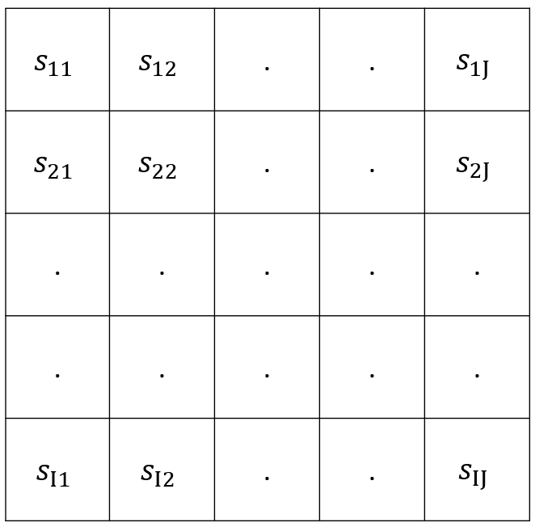
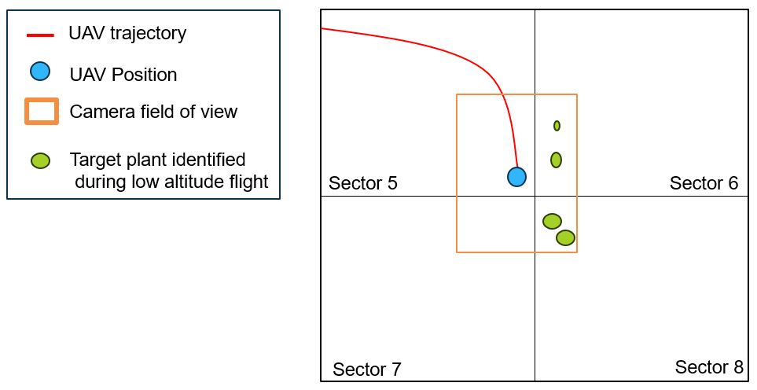
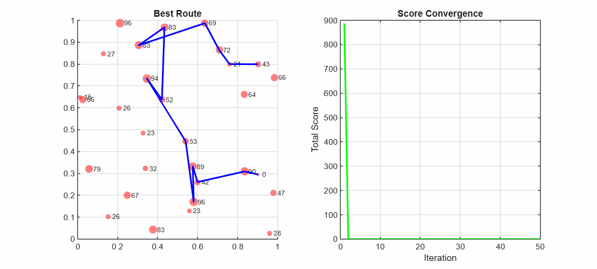

# Autonomous Search, Location, and Quantification of Target Plant Species Using Machine Learning and ACO Path Planning

## Motivation
Conventional UAV-based remote sensing utilizes standard coverage algorithms to survey a designated area. These methods typically employ a "lawnmower" pattern, executing a rigid, zig-zag flight path to ensure complete coverage of the terrain. While exhaustive, this approach is highly inefficient when searching for a specific target plant species, as it results in the collection of vast amounts of irrelevant data.

The objective of this project is to overcome this inefficiency by developing a dynamic, learning-based search strategy designed to autonomously locate and quantify target plant species within an a priori unknown environment. The video below shows a photorealistic simulation of an autonomous quadrotor conducting plant search using the Ant Colony Optimization route-planning algorithm. The simulation was conducted using Unreal Engine and MATLAB Simulink.
<figure>
  <video src="media/UE_simu.mp4" width="600" autoplay loop muted playsinline></video>
  <figcaption><em>Video. 1: Photorealistic simulation using Unreal Engine and MATLAB.</em></figcaption>
</figure>

## Methodology
This project presents two distinct approaches for terrain exploration. Instead of scanning blindly, the system utilizes high-level decision-making algorithms to learn the spatial distribution of the environment and prioritize sectors where target discoveries are most probable. The two approaches are:
1. **Reinforcement Learning:** Ant Colony Optimization (ACO) for trajectory generation, guided by a UCB1 algorithm for high-level sector selection.
2. **Supervised Learning:** Ant Colony Optimization (ACO) for trajectory generation, guided by a Multi-Layer Perceptron (MLP) for predictive sector value estimation.

The terrain of interest is modeled as a 2D grid of dimension $I \times J$ shown in Fig. 1 where each cell $s_{ij}$ represents a specific geographic area called a sector. The dimension of the grid is user defined. 
<figure>
  
  <figcaption><em>Fig. 1: Partition of the terrain of interest into sectors.</em></figcaption>
</figure>
The agent selects a target sector $s_{ij}$ to visit from $S \in \mathbb{R}^{I \times J}$  based on the quantity of target plants recorded within that specific sector. An example of target plant species detection during low-altitude flight is shown in Fig. 28, where target plants were detected in sectors 6 and 8. The UCB TPS2 algorithm suggests the center coordinate of the sector to visit to maximize the likelihood of further discoveries. However, DEE-ACS may still be unable to include the coordinate suggested by UCB-TPS2 if the available energy budget is insufficient.

<figure>
  
  <figcaption><em>Fig. 2: Target plant species detection during low altitude flight.</em></figcaption>
</figure>

## Ant Colony Optimization
To generate optimal flight paths for the UAV, the system utilizes an adapted version of the Ant Colony Optimization (ACO) algorithm [1] designed to solve the Orienteering Problem (OP) [2]. In this framework, the vehicle's flight path is explicitly constrained by a total travel budget, which is defined by the available onboard battery energy. Unlike traditional path planning that only calculates geometric distance, this modified ACO algorithm incorporates a comprehensive aerodynamic cost function. The cost associated with traversing between sectors accounts for both the physical distance and the aerodynamic drag caused by environmental wind vectors. By simulating artificial ants that deposit pheromones along candidate paths, the algorithm evaluates trajectories based on the trade-off between maximizing target discovery rewards and minimizing energy expenditure. Ultimately, the ACO algorithm converges on a flight trajectory that yields the maximum possible information gain while strictly ensuring the UAV returns safely within its operational battery limits.

<figure>
  
  <figcaption><em>Fig. 3: Path planning by ACO.</em></figcaption>
</figure>

##  Upper confidence bound (UCB1) - Reinforcement Learning
The 2D grid of sectors $S \in \mathbb{R}^{I \times J}$, is flattened to a 1D vector $s \in \mathbb{R}^{n_s}$, which is given as $s = \[s1,\dots ,s_{n_s}\]$. Each discovery of a target plant initiates a timestep in UCB1 algorithm. At each timestep, the reward, the mean reward, and the UCB scores of all sectors are updated  [3]. Over time, the sectors that contribute to more discoveries will exhibit a higher average reward. Conversely, the UCB score of less frequently chosen sectors can increase to encourage exploration.

## References

  [1] Dorigo, M., Maniezzo, V., & Colorni, A. (1996). "Ant system: optimization by a colony of cooperating agents." <em>IEEE Transactions on Systems, Man, and Cybernetics, Part B (Cybernetics)</em>, 26(1), 29–41.

  [2] Liang, Y.-C., & Smith, A. E. (2006). "An ant colony approach to the orienteering problem." <em>Journal of the Chinese Institute of Industrial Engineers</em>, 23(5), 403–414.

  [3] Bouneffouf, D., Rish, I., & Aggarwal, C. (2020). "Survey on applications of multi-armed and contextual bandits." in <em>2020 IEEE Congress on Evolutionary Computation (CEC)</em>, IEEE, pp. 1–8.

  [4] Elena, G., Milos, K., & Eugene, I. (2021). "Survey of multiarmed bandit algorithms applied to recommendation systems." <em>International Journal of Open Information Technologies</em>, 9(4), 12–27.

  [5] Govers, F. X. (2018). <em>Artificial Intelligence for Robotics: Build intelligent robots that perform human tasks using AI techniques</em>. Packt Publishing Ltd.

