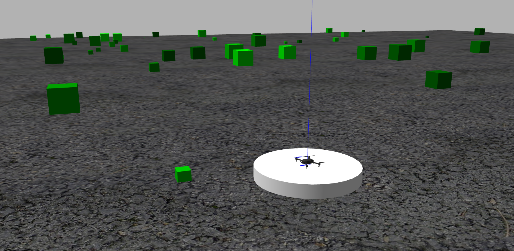
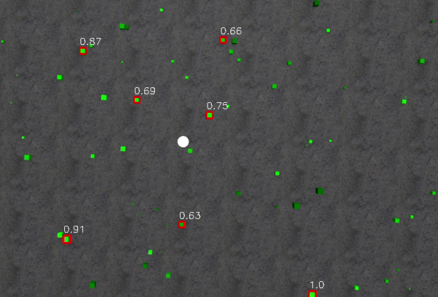
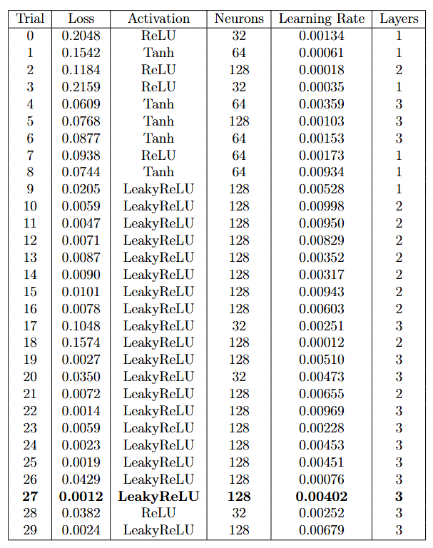
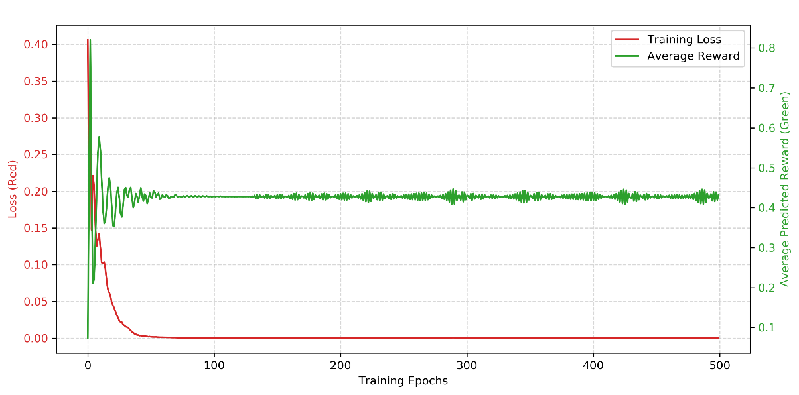

# Autonomous Search, Location, and Quantification of Target Plant Species Using Machine Learning and ACO Path Planning

## Motivation
Conventional UAV-based remote sensing utilizes standard coverage algorithms to survey a designated area. These methods typically employ a "lawnmower" pattern, executing a rigid, zig-zag flight path to ensure complete coverage of the terrain. While exhaustive, this approach is highly inefficient when searching for a specific target plant species, as it results in the collection of vast amounts of irrelevant data.

The objective of this project is to overcome this inefficiency by developing a dynamic, learning-based search strategy designed to autonomously locate and quantify target plant species within an a priori unknown environment. The video below shows a photorealistic simulation of an autonomous quadrotor conducting plant search using the Ant Colony Optimization route-planning algorithm. The simulation was conducted using Unreal Engine and MATLAB Simulink.
<figure>
  <video src="media/UE_simu.mp4" width="600" autoplay loop muted playsinline></video>
  <figcaption><em>Video. 1: Photorealistic simulation using Unreal Engine and MATLAB.</em></figcaption>
</figure>

## Methodology
This project presents two distinct approaches for terrain exploration. Instead of scanning blindly, the system utilizes high-level decision-making algorithms to learn the spatial distribution of the environment and prioritize sectors where target discoveries are most probable. The two approaches are:
1. **Reinforcement Learning:** Ant Colony Optimization (ACO) for trajectory generation, guided by a UCB1 algorithm for high-level sector selection.
2. **Supervised Learning:** Ant Colony Optimization (ACO) for trajectory generation, guided by a Multi-Layer Perceptron (MLP) for predictive sector value estimation.

The terrain of interest is modeled as a 2D grid of dimension $I \times J$ shown in Fig. 1 where each cell $s_{ij}$ represents a specific geographic area called a sector. The dimension of the grid is user defined. 
<figure>
  
  <figcaption><em>Fig. 1: Partition of the terrain of interest into sectors.</em></figcaption>
</figure>
The agent selects a target sector $s_{ij}$ to visit from $S \in \mathbb{R}^{I \times J}$  based on the quantity of target plants recorded within that specific sector. An example of target plant species detection during low-altitude flight is shown in Fig. 28, where target plants were detected in sectors 6 and 8. The UCB TPS2 algorithm suggests the center coordinate of the sector to visit to maximize the likelihood of further discoveries. However, DEE-ACS may still be unable to include the coordinate suggested by UCB-TPS2 if the available energy budget is insufficient.

<figure>
  
  <figcaption><em>Fig. 2: Target plant species detection during low altitude flight.</em></figcaption>
</figure>

## Ant Colony Optimization
To generate optimal flight paths for the UAV, the system utilizes an adapted version of the Ant Colony Optimization (ACO) algorithm [1] designed to solve the Orienteering Problem (OP) [2]. In this framework, the vehicle's flight path is explicitly constrained by a total travel budget, which is defined by the available onboard battery energy. Unlike traditional path planning that only calculates geometric distance, this modified ACO algorithm incorporates a comprehensive aerodynamic cost function. The cost associated with traversing between sectors accounts for both the physical distance and the aerodynamic drag caused by environmental wind vectors. By simulating artificial ants that deposit pheromones along candidate paths, the algorithm evaluates trajectories based on the trade-off between maximizing target discovery rewards and minimizing energy expenditure. Ultimately, the ACO algorithm converges on a flight trajectory that yields the maximum possible information gain while strictly ensuring the UAV returns safely within its operational battery limits.

<figure>
  
  <figcaption><em>Fig. 3: Path planning by ACO.</em></figcaption>
</figure>

##  Upper confidence bound (UCB1) - Reinforcement Learning
The 2D grid of sectors $S \in \mathbb{R}^{I \times J}$, is flattened to a 1D vector $s \in \mathbb{R}^{n_s}$, which is given as $s = \[s1,\dots ,s_{n_s}\]$. The image processing algorithm generates the set of coordinates
of discovered target plant species in the terrain of interest during low-altitude flight, along with their corresponding canopy cover, denoted as $\tilde{\lambda}$, and $\tilde{\mathfrak{c}}$, respectively, and
they have a dynamic size. Each discovery of a target plant initiates a timestep in UCB1 algorithm. The UCB1 selects the sector to visit, and the reward for a sector is given by,

$$r_i(\tilde{t}) = \sum_{\mathfrak{p}=1}^{|\tilde{\lambda}(\tilde{t})|} \mathbb{I}( \tilde{\lambda}_\mathfrak{p} \in s_i ) \cdot \tilde{\mathfrak{c}}_\mathfrak{p}$$

where $\tilde{t}$ is the timestep, $\mathbb{I}(\cdot)$  denotes the indicator function, which equals 1 if the condition is true and 0 otherwise. At each timestep, the reward, the mean reward, and the UCB scores of all sectors are updated  [3]. Over time, the sectors that contribute to more discoveries will exhibit a higher average reward. Conversely, the UCB score of less frequently chosen sectors can increase to encourage exploration.

## Multi-layer Perceptron based value prediction - Superviced Learning
The neural network (NN) is trained using an exploration logic, which provides the desired values for supervised offline training. This allows the trained model to generalize the exploration logic and perform this operation in any unknown fields. To find the optimal NN architecture, neural architecture search (NAS) is conducted. Then, the learning rate and activation function are selected using hyperparameter optimization (HPO). To conduct HPO and NAS, an AI optimization library called Optuna [6] is used. The Optuna library can automatically build multiple different NN structures, test different learning rates, and test different activation functions, and the best model is selected from the trial results.

The environment for training the NN is a spatial exploration environment, which is a 2D field divided into a grid of sectors given by $s = \[s_1,\dots,s_{n_s}\]$. Random planar coordinates and a random canopy score are generated for each sector to simulate target plant discovery during the training phase. The observation is a state vector given as $obs = \[x_i,y_i,n_i,r_i\]$, where $x_i$ and $y_i$ are the planar center coordinates of
sector $i$, $n_i$ is the number of times sector $i$ has been visited, and $r_i$ is the current score of sector $i$. The desired Q-score for sector $i$ is given by,

$$Q(s_i) = \max\left(0,\; d_q + 0.5 r_i - 0.5 n_i \right)$$

where $d_q$ is the distance between the center of sector $i$ and the quadrotor. The decision-making MLP-based policy is given by,

$$a_t = \pi(s) = \arg\max_{s_i \in s} Q(s_i)$$

where $a_t$ denotes the action, representing the selected sector.

## Simulation

The algorithm is tested in a ROS + PX4 simulation environment, where the Robot Operating System (ROS) is a general-purpose robotics framework, and PX4 is an open-source autopilot firmware. The vehicle used is the Iris quadrotor, which is modeled within the PX4-Autopilot ecosystem and simulated in the Gazebo environment. The vehicle is equipped with a generic simulated depth camera, modeled to resemble an RGB-D sensor similar to Intel RealSense. The vehicle’s dynamics and control are handled by the PX4 firmware operating in Software-in-the-Loop (SITL) mode. Communication between ROS and the low-level flight control firmware PX4 is managed by the MAVROS package using the MAVLink protocol.

Fig. 4 shows the Gazebo world representing a heterogeneous terrain. The place where the user is located is called the base. In this gazebo world, the base is located at the centre of the terrain of interest, indicated by a white cylinder. The plants growing in the terrain of interest are represented by green-colored cubes. Cubes with random sizes, varying shades of green, and random locations are spawned in the Gazebo world, reflecting that different plant species can have the same shape, grow in random locations, and exhibit different shades of green. 
<figure>
  
  <figcaption><em>Fig. 4: Gazebo world representing terrain of interest.</em></figcaption>
</figure>
The targets are the light-colored plants between Hue, Saturation, and Value (HSV) range [50, 100, 140] to [70, 255, 255], highlighted by a red bounding box in the high altitude image shown in Fig.5. The scores of the cubes are proportional to their sizes and are normalized using max normalization, which is given as: the score equals the pixel area of the current contour divided by the area of the largest contour found so far in
the frame.
<figure>
  
  <figcaption><em>Fig. 5: High altitude image of the terrain of interest in the gazebo world.</em></figcaption>
</figure>

 The Optuna runs mini training sessions with different combinations of neural network structures, learning rates, and activation functions, and identifies the best-performing configuration. The number of trials has been set at 30, which means that Optuna will create 30 different neural networks. The learning rate range was set from $1 \times 10^{−4}$ to $1 \times 10^{−2}$, and three activation functions, ReLu, Tanh, and LeakyReLu were used. Each of the 30 neural network models is trained for 50 epochs to evaluate whether the architecture is good or bad. Table 1 shows the trial results. It can be observed that the model in trial 27, with LeakyReLU activation, a learning rate of 0.00402, three layers, and 128 neurons in each layer, achieves the minimum loss and is therefore selected.
<figure>
  
  <figcaption><em>Table 1: Optuna hyperparameter optimization results.</em></figcaption>
</figure>

The chosen neural network model is trained for an additional 500 epochs.  Fig.6 shows the training results, where the red curve indicates the loss and the green curve indicates the reward. The loss drops heavily initially and approaches near-zero around epoch 40, and maintains this minimum, indicating that the model has successfully converged. The reward increases over time, exhibiting high variance initially and
stabilizing after 50 epochs, indicating that the agent has successfully learned the exploration logic
<figure>
  
  <figcaption><em>Fig. 6: Training result: loss vs reward plot.</em></figcaption>
</figure>

The entire target plant species search mission is carried out in the following steps:
* Take off from the base at the planned time set by the user.
* High-altitude flight to estimate the locations of target plant species.
* Initial path planning connecting locations with a higher probability of target plant presence.
* Begin low-altitude flight along the initial path.
* UCB-TPS2 suggests sectors with a high probability of target plant species presence, and the UAV dynamically reroutes using DEE-ACS.
* Continue the mission until the available battery energy budget is sufficient to return to the base.
* Return to the base.

The high-altitude hover is set to a desired altitude of 50 meters, while the low altitude flight is set at 10 meters.

<figure style="text-align: center;">
  

    <iframe src="https://www.youtube.com/embed/duWaJdp7LfY" 
            style="position: absolute; top: 0; left: 0; width: 100%; height: 100%; border: 0;" 
            allow="accelerometer; autoplay; clipboard-write; encrypted-media; gyroscope; picture-in-picture; web-share" 
            allowfullscreen>
    </iframe>
  

  <figcaption style="margin-top: 10px;"><em>Video. 2: SITL Gazebo simulation run mapping discoveries using the dynamic UCB1 exploration and EEPC-ACO path planning loop.</em></figcaption>
</figure>

## References

  [1] Dorigo, M., Maniezzo, V., & Colorni, A. (1996). "Ant system: optimization by a colony of cooperating agents." <em>IEEE Transactions on Systems, Man, and Cybernetics, Part B (Cybernetics)</em>, 26(1), 29–41.

  [2] Liang, Y.-C., & Smith, A. E. (2006). "An ant colony approach to the orienteering problem." <em>Journal of the Chinese Institute of Industrial Engineers</em>, 23(5), 403–414.

  [3] Bouneffouf, D., Rish, I., & Aggarwal, C. (2020). "Survey on applications of multi-armed and contextual bandits." in <em>2020 IEEE Congress on Evolutionary Computation (CEC)</em>, IEEE, pp. 1–8.

  [4] Elena, G., Milos, K., & Eugene, I. (2021). "Survey of multiarmed bandit algorithms applied to recommendation systems." <em>International Journal of Open Information Technologies</em>, 9(4), 12–27.

  [5] Govers, F. X. (2018). <em>Artificial Intelligence for Robotics: Build intelligent robots that perform human tasks using AI techniques</em>. Packt Publishing Ltd.

  [6]: Akiba, T., Sano, S., Yanase, T., Ohta, & Koyama, M. (2019). "Optuna: A next-generation hyperparameter optimization framework." in <em>Proceedings of the 25th ACM SIGKDD International Conference on Knowledge Discovery & Data Mining</em>, pp. 2623–2631.

